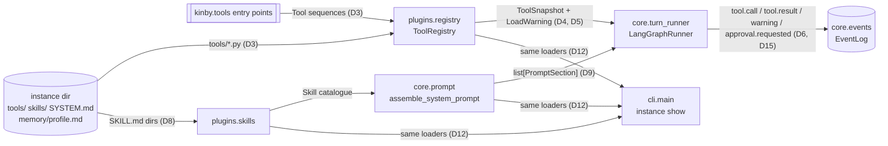
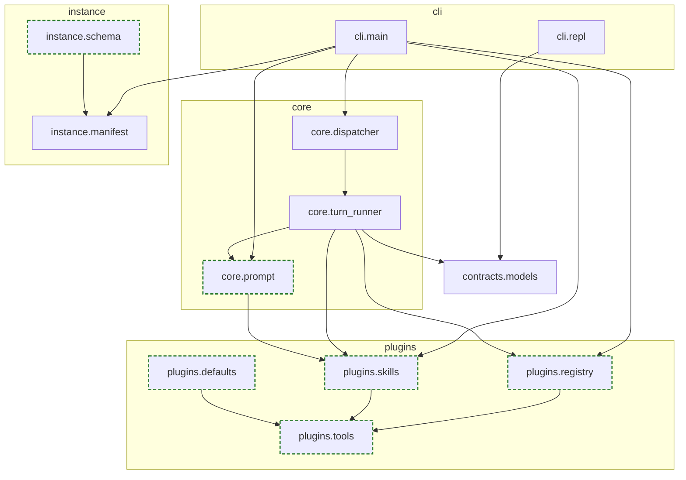
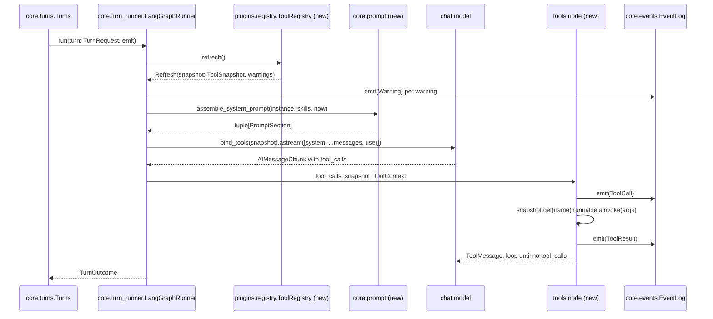
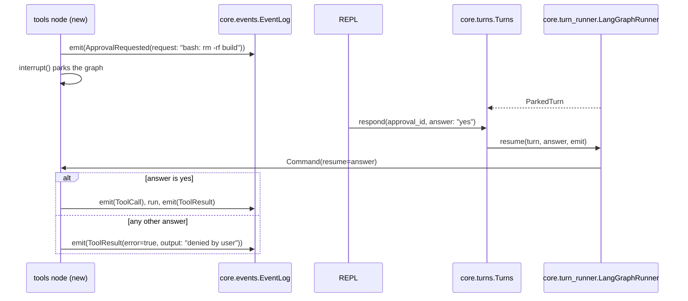
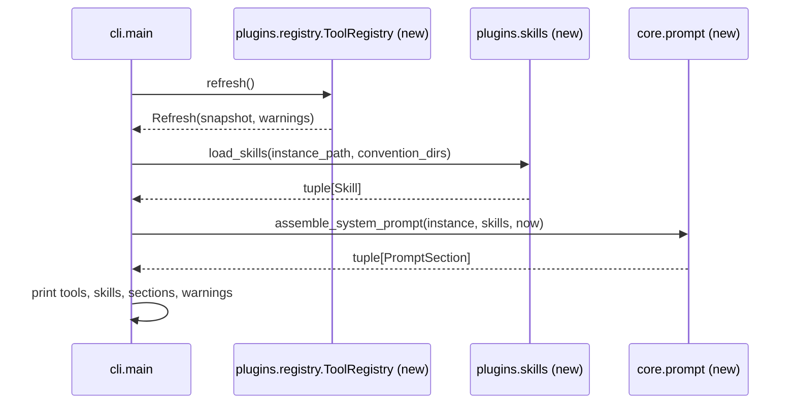

# Plugins: tools, skills, system prompt assembly

| | |
|---|---|
| **Status** | draft |
| **Source** | grilling on #6 (resolved), build spec #43; 2026-08-28 |
| **Stamped at** | `707a5b7` (paths and symbols are true at this commit) |
| **Owner** | Jorge Soler |

## At a glance *(explanation)*

You drop a Python file in your instance's `tools/`, a `SKILL.md` folder in `skills/`, or edit `SYSTEM.md`, and the next turn uses it. Tools come from the instance directory and from installed packages through one registry that rescans at every turn start. The system prompt is a fixed sequence of sections with the volatile environment block last. The decision that shapes the rest is D4: no watcher, no reload command, the turn boundary is the only moment the tool set changes, which keeps the provider's prompt cache valid across turns and keeps the runtime free of background tasks.

## Problem *(explanation)*

A turn runs the model with no tools and a bare user message. `kinby init` writes `tools/`, `skills/` and `SYSTEM.md`, and nothing reads them. You cannot give your teammate a capability, tell it how to behave, or see what it would load before spending a model call.

## Solution *(explanation)*

Every turn, the runner reloads the manifest, rescans `tools/`, reads the skills, and assembles the system prompt. The model can call your tools. Write tools park the turn on an approval request that you answer from the REPL. `kinby instance show` prints the tools, skills and prompt sections a turn would use, with any load warnings. A generated JSON Schema for `kinby.toml` lives in the repo.

## Decision log *(explanation)*

| # | Decision | Chosen | Rejected | Why |
|---|---|---|---|---|
| D1 | What a tool author writes | A function decorated with `tool(write=...)` from `kinby.plugins`; the decorator builds a LangChain `StructuredTool` and a frozen `Tool` record (name, write flag, source) | Bare LangChain `@tool` functions; a `Tool` class to subclass | One import, the write flag next to the function, and the core never depends on LangChain metadata conventions. (#6) |
| D2 | What a tool declares | Only `write` | Config schema, touched paths, required env vars | Config goes through env or module constants. Path rules read arguments and belong to the gate (#7). Fields get added when a real tool needs one. (#6) |
| D3 | Discovery sources and clash rule | Instance `tools/*.py` plus the `kinby.tools` entry-point group; the default package is kinby's own entry point, switchable off with `[tools] defaults = false`; an instance file shadows a same-named entry-point tool; two instance files exporting one name is a load error | One source only; hard error on any clash | Shadowing is how you replace `bash` without forking kinby. Two files exporting one name is an accident and should be loud. (#6) |
| D4 | When the registry re-reads | Rescan at every turn start by directory signature (paths and mtimes) | Background `watchfiles` task; a `/reload` command | Same rhythm as the manifest re-read, no background task, no dependency. A tool-list change costs one cache write per turn anyway. (#6, ADR 0010) |
| D5 | Failed rescan | Keep the previous tool set, emit a `warning` event naming the file and the error | Fail the turn; drop only the broken file | One typo must not take the agent down, and a silent drop hides the problem. (#6) |
| D6 | Gate stance for a new tool | Loading needs no approval. A write tool parks the turn on `approval.requested`; `yes` runs it, anything else denies it with a tool error to the model. Non-write tools run | Approval at load time; a stricter default for package tools | The user placed the file or installed the package. Rule shapes in `permissions.toml` belong to #7. (#6) |
| D7 | What the core hands a running tool | A `ToolContext` (instance, workspace path, thread id) on an annotated parameter hidden from the model schema | Globals and cwd; a module-level accessor | Explicit and testable. The model never sees the parameter. (#6) |
| D8 | Skill format and disclosure | `skills/<name>/SKILL.md` with `name` and `description` frontmatter; a catalogue of names and descriptions in the prompt; a core `skill` tool returns a body on demand | Every skill body in the prompt; body injected when the model names it | Bodies in the prompt thrash the cache and stop scaling past a few skills. The catalogue is stable text. (#6) |
| D9 | System prompt order | Fixed in core: preamble, `SYSTEM.md`, workspace instructions, skills catalogue, `profile.md`, environment block last | An open prompt-section registry plugins write to | Stable text first, the date last, so a day change invalidates only the tail. Memory content beyond `profile.md` is #8's call. (#6) |
| D10 | MCP | Out of the v1 build; `mcp.json` leaves the instance anatomy; returns as fog | External servers through adapters now | Native plugging covers the destination. A second tool source before the first has evals is machinery without a user. (#6, ADR 0010) |
| D11 | `.teach` review pass `mount(spec, read_only=)` | Dropped | Keep as a load-time review gate | Covered by write-asks plus the load warning. (#6) |
| D12 | Visibility | `kinby instance show` lists tools, skills and prompt sections through the same loaders the turn uses, plus load warnings | A `tools.changed` stream event | One code path for "what would load". Stream events wait for #12. (#6) |
| D13 | Manifest schema | JSON Schema generated from the manifest model into `docs/schema/`, with a staleness test | A hand-written reference | The model is the reference. (#6) |
| D14 | Tool node | A custom tool node that looks the call up in the turn's registry snapshot; an unknown name returns a tool error to the model | LangGraph's prebuilt `ToolNode` | `ToolNode` fixes its tools at construction. The custom node is a short function and gives the model a recoverable error for a deleted tool. (#3 research) |
| D15 | Tool events | `tool.call` (name, arguments) and `tool.result` (name, output, error flag) on the stream per execution | Tool activity only in the checkpointer | The transcript store must record what the agent did. `EventType` already reserves both names. (#28) |
| D16 | Frontmatter parsing | A minimal parser for `---` fenced `key: value` lines | A `pyyaml` dependency | Two string fields do not justify a YAML parser. Revisit when a field needs structure. |
| D17 | Wiring | `turn_config` takes the `Instance`; the runner reloads the manifest and rescans plugins at the start of `run` and `resume` | A bare model string plus a separate plugin object | The runner needs the instance directory, the conventions and the manifest every turn. |

## User stories *(reference)*

See spec #43. The 28 stories there are the acceptance list; this doc does not repeat them.

## Bird's-eye flow *(reference)*



Figure: how instance files and installed packages become the tools, skills and system prompt of one turn, and how `show` reuses the same loaders.

Prose walkthrough, one step per arrow:

1. `ToolRegistry.refresh` scans `tools/*.py`, executes each changed file as a fresh module, and collects every `Tool` the module exposes.
2. The same refresh reads the `kinby.tools` entry-point group once per session. The default package is one of those entries when `[tools] defaults` is true.
3. `load_skills` reads `skills/*/SKILL.md` from the instance and from each workspace convention skill directory, instance first.
4. `assemble_system_prompt` turns the skill list into the catalogue section.
5. At the start of `run` or `resume`, `LangGraphRunner` calls `refresh` and receives a name-sorted `ToolSnapshot` plus any `LoadWarning`.
6. The runner also receives the assembled `PromptSection` list and joins it into the system message.
7. During the turn, each tool execution emits `tool.call` and `tool.result`; a write tool emits `approval.requested` and parks; each warning emits `warning`.
8. `kinby instance show` calls the three loaders and prints their results.

## Module map *(reference)*



Figure: dependency graph of the modules plugins touch, new ones dashed. `plugins.defaults` is reached only through the entry point, never imported by core.

### Interfaces

Existing at `707a5b7` unless marked `new`.

- `plugins.tools.tool(*, write: bool)` `new`. Decorator. Returns a `Tool` record wrapping a `StructuredTool` built from the function signature and docstring. A parameter annotated `ToolContext` is excluded from the model schema and filled at call time.
- `plugins.tools.Tool` `new`. Frozen record: `name`, `write`, `source`, `runnable`.
- `plugins.tools.ToolContext` `new`. Frozen record: `instance: Instance`, `workspace: Path`, `thread_id: UUID`.
- `plugins.registry.ToolRegistry(instance_path, *, defaults: bool)` `new`. `refresh() -> Refresh` rescans and returns the snapshot plus warnings. `snapshot() -> ToolSnapshot` returns the last good set. Called by the runner at turn start and by `show`.
- `plugins.registry.ToolSnapshot` `new`. Name-sorted tuple of `Tool`; `get(name) -> Tool | None`.
- `plugins.registry.LoadWarning` `new`. `source: str`, `message: str`.
- `plugins.skills.load_skills(instance_path, convention_dirs) -> tuple[Skill, ...]` `new`. Instance skills first, workspace skills after, first name wins.
- `plugins.skills.Skill` `new`. `name`, `description`, `source`, `body()`.
- `plugins.skills.skill_tool(skills) -> Tool` `new`. The core `skill` tool, non-write, returns a body by name or a tool error.
- `plugins.defaults.TOOLS` `new`. The sequence the `kinby.tools` entry point `defaults` resolves to: `read`, `write`, `edit`, `grep`, `glob`, `bash`.
- `core.prompt.assemble_system_prompt(instance, skills, now) -> tuple[PromptSection, ...]` `new`. Fixed order per D9. Missing files skip their section.
- `core.prompt.PromptSection` `new`. `name`, `source`, `text`.
- `core.turn_runner.LangGraphRunner(instance, *, model_factory, model_override)` modify. Replaces `LangGraphRunner(model, ...)`. Graph gains a `tools` node and a conditional edge on tool calls. `run` and `resume` reload the manifest and refresh the registry first.
- `core.dispatcher.turn_config(instance, *, model_override) -> TurnConfig` modify. Replaces `turn_config(model)`.
- `instance.manifest.RawTools` `new` and `instance.dataclasses.Tools` `new`. `defaults: bool = True`.
- `instance.schema.manifest_schema() -> dict` `new`. JSON Schema of `RawManifest`. Runnable as a module to rewrite `docs/schema/kinby.schema.json`.
- `contracts.models.ToolCall`, `ToolResult`, `Warning` `new`. Payloads; `Payload` union and `EventType` gain `warning`.
- `cli.main._print_instance` modify. Prints tools, skills, prompt sections, warnings after the existing lines.
- `cli.repl` modify. Renders `tool.call`, `tool.result` and `warning`.

## Ground-level flows *(reference)*

### Flow: turn start with a tool call



Figure: one turn from `run` to `TurnOutcome` when the model calls a non-write tool.

1. `Turns.start` calls `run` with a `TurnRequest` (thread id, turn id, message).
2. `refresh` returns a `Refresh`: the `ToolSnapshot` for this turn and zero or more `LoadWarning`.
3. Each warning becomes a `Warning` event on the stream.
4. `assemble_system_prompt` returns the sections; the runner joins them into one system message.
5. The model node binds the snapshot and streams; deltas emit `message.delta` as today.
6. The tools node emits `ToolCall`, runs the tool with the `ToolContext`, emits `ToolResult` (error flag set when the tool raised or the name is unknown), and appends a `ToolMessage`.
7. The graph loops to the model node until a response has no tool calls, then returns `TurnOutcome` with usage.

### Flow: write tool approval



Figure: how a write tool parks the turn and how the answer resumes it.

1. The tools node finds `tool.write` true, emits `ApprovalRequested` whose `request` names the tool and its arguments, and calls LangGraph `interrupt()`.
2. The runner returns `ParkedTurn`; `Turns` leaves the thread parked as today.
3. `thread.approval.respond` reaches `Turns.respond`, which calls `resume` with the free-form answer.
4. The runner resumes the graph with the answer. `yes` runs the tool; anything else records a denied `ToolResult` and the model continues.

### Flow: instance show



Figure: `kinby instance show` reads through the same three loaders a turn uses.

1. `show` builds a `ToolRegistry` from the loaded instance and refreshes it once.
2. It loads skills and assembles the prompt with the same calls the runner makes.
3. It prints, after the existing lines: `tools:` (name, `write` or `read`, source), `skills:` (name, source), `prompt sections:` (name, source, character count), `warnings:` (source, message).

## Data shapes *(reference)*

```mermaid
classDiagram
  class Tool {
    name: str
    write: bool
    source: str
    runnable: StructuredTool
  }
  class ToolContext {
    instance: Instance
    workspace: Path
    thread_id: UUID
  }
  class ToolSnapshot {
    tools: tuple~Tool~
    get(name) Tool
  }
  class LoadWarning {
    source: str
    message: str
  }
  class Refresh {
    snapshot: ToolSnapshot
    warnings: tuple~LoadWarning~
  }
  class Skill {
    name: str
    description: str
    source: Path
    body() str
  }
  class PromptSection {
    name: str
    source: str
    text: str
  }
  class Tools {
    defaults: bool
  }
  ToolSnapshot o-- Tool
  Refresh o-- ToolSnapshot
  Refresh o-- LoadWarning
  classDef new stroke:#2e7d32,stroke-width:2px,stroke-dasharray:5 3
  class Tool,ToolContext,ToolSnapshot,LoadWarning,Refresh,Skill,PromptSection,Tools new
```

Figure: the records plugins add. `Tools` is the manifest's new `[tools]` table.

```mermaid
classDiagram
  class ToolCall {
    type: "tool.call"
    call_id: str
    name: str
    arguments: dict
  }
  class ToolResult {
    type: "tool.result"
    call_id: str
    name: str
    output: str
    error: bool
  }
  class Warning {
    type: "warning"
    source: str
    message: str
  }
  classDef new stroke:#2e7d32,stroke-width:2px,stroke-dasharray:5 3
  class ToolCall,ToolResult,Warning new
```

Figure: the three event payloads added to `contracts.models`. `ApprovalRequested` is unchanged; its `request` string now names the tool and arguments.

## File map *(reference)*

| Path | Action | What changes | Flow |
|---|---|---|---|
| `src/kinby/plugins/tools.py` | create | `tool` decorator, `Tool`, `ToolContext` | turn start |
| `src/kinby/plugins/registry.py` | create | `ToolRegistry`, `ToolSnapshot`, `LoadWarning`, `Refresh`, file loader, entry-point loader | turn start, show |
| `src/kinby/plugins/skills.py` | create | `Skill`, `load_skills`, frontmatter parser, `skill_tool` | turn start, show |
| `src/kinby/plugins/defaults/__init__.py` | create | `TOOLS` sequence | turn start |
| `src/kinby/plugins/defaults/files.py` | create | `read`, `write`, `edit`, `glob`, `grep` | turn start |
| `src/kinby/plugins/defaults/shell.py` | create | `bash` | turn start |
| `src/kinby/core/prompt.py` | create | `assemble_system_prompt`, `PromptSection` | turn start, show |
| `src/kinby/core/turn_runner.py` | modify | Instance-based constructor, tools node, per-turn refresh and reload, approval on write | turn start, approval |
| `src/kinby/core/dispatcher.py` | modify | `turn_config(instance, *, model_override)` | turn start |
| `src/kinby/contracts/models.py` | modify | `ToolCall`, `ToolResult`, `Warning`, `EventType.WARNING`, `Payload` union | turn start |
| `src/kinby/instance/manifest.py` | modify | `RawTools` table | turn start |
| `src/kinby/instance/dataclasses.py` | modify | `Tools` on `Manifest` | turn start |
| `src/kinby/instance/layout.py` | modify | `SKILL_FILE = "SKILL.md"` | show |
| `src/kinby/instance/schema.py` | create | `manifest_schema`, module main | schema |
| `src/kinby/cli/main.py` | modify | `show` lists; `_run_instance` passes the instance | show |
| `src/kinby/cli/repl.py` | modify | Render `tool.call`, `tool.result`, `warning` | turn start |
| `pyproject.toml` | modify | `[project.entry-points."kinby.tools"] defaults = "kinby.plugins.defaults:TOOLS"` | turn start |
| `docs/schema/kinby.schema.json` | create | Generated schema | schema |
| `examples/instances/coding-agent/tools/` | create | One example tool | turn start |
| `tests/test_plugins.py` | create | Dispatcher-level tool, skill and prompt scenarios | all |
| `tests/test_instance_show.py` | modify | Tools, skills, sections, warnings in `show` | show |
| `tests/test_schema.py` | create | Staleness check | schema |
| `tests/test_turns.py` | modify | Runner construction takes an instance | turn start |
| `tests/test_run.py` | modify | Same | turn start |

## Testing *(reference)*

- **Seams.** The dispatcher (`build_dispatcher` with a `TurnConfig` whose runner uses a scripted `model_factory`) and the CLI `show` command. Both exist. No loader is tested directly (D12: one code path).
- **What a good test looks like here.** Build a temp instance directory, run `thread.turn.start`, assert on the events that land in the log and on the messages and tools the scripted model received. Never call a provider.
- **Prior art.** `tests/test_turns.py` (scripted runners, dispatcher scenarios), `tests/test_instance_show.py` (CLI output), `tests/test_run.py` (instance plus `--model`).
- **Cases.**
  1. A tool in `tools/` is bound and called; `tool.call` and `tool.result` land in order (turn start, D1, D15).
  2. The default `read` tool is present by default and absent with `[tools] defaults = false` (turn start, D3).
  3. An instance `bash.py` shadows the default `bash` (turn start, D3).
  4. Two files exporting one name produce a `warning` naming both, and the previous set stays (turn start, D3, D5).
  5. A syntax error in one file produces a `warning` and the previous set stays (turn start, D5).
  6. Editing a tool file between turns changes what the second turn binds; deleting it removes the tool (turn start, D4).
  7. A tool the model names that is not in the snapshot yields `tool.result` with `error=true` and the turn completes (turn start, D14).
  8. A write tool parks with `approval.requested` naming the tool; `yes` runs it; `no` yields a denied `tool.result` (approval, D6).
  9. The `ToolContext` reaches the tool with the workspace path and thread id and is absent from the schema the model sees (turn start, D7).
  10. Skills from the instance and the workspace appear in the catalogue, instance first, and the `skill` tool returns a body (turn start, D8).
  11. The system message has the sections in D9 order with the date last; a missing `profile.md` skips its section (turn start, D9).
  12. `show` prints tools, skills, sections and warnings for the same instance (show, D12).
  13. `docs/schema/kinby.schema.json` equals `manifest_schema()` (schema, D13).
  14. An interrupt during a tool loop ends with `turn.interrupted` and no further `tool.call` (turn start, ADR 0008).

## Out of scope *(reference)*

- MCP as a tool source (fog on the map).
- `permissions.toml` rules, path rules, sandboxing (#7).
- Memory in the prompt beyond `profile.md` (#8).
- Per-tool usage attribution and richer observability (#12).
- Sub-agents and the recap subagent (#9).
- A file watcher or `/reload` command (D4).
- Tools from the workspace (#4).

## Open questions *(reference)*

1. **A parked write tool across a restart.** ADR 0009 resumes placeholder approvals from the event log by re-running the turn. A write tool parks mid-graph, and the `InMemorySaver` loses that state on restart. Options: add a persistent checkpointer in `.state/` now; or fail `resume` after a restart with a clear `NO_ACTIVE_TURN`-style error and let #7 add persistence. Recommended default: the second; keep the dependency out until the gate ticket decides the checkpointer.
2. **Default `bash` working directory and timeout.** Workspace path as cwd is settled by D7. Timeout and output cap are not. Recommended default: 120 s, 30k characters, both constants in `plugins.defaults.shell`.
3. **Entry points re-read.** D4 reads them once per session. If a package is installed while `kinby run` is open, it appears next session. Recommended default: leave it; document it in the tool-author page.

## Glossary *(reference)*

- **Plugin.** Anything an instance loads beyond the core: a tool or a skill.
- **Tool.** A native Python capability the model can call during a turn, declaring whether it writes.
- **Skill.** A markdown instruction set the model reads on demand.
- **Behavior prompt.** The instance's `SYSTEM.md`.
- **Turn.** One user-to-agent cycle; the moment the tool set may change.
- **Approval.** A user decision a live turn waits on.
- **Event.** One sequence-numbered record on a thread's stream.
