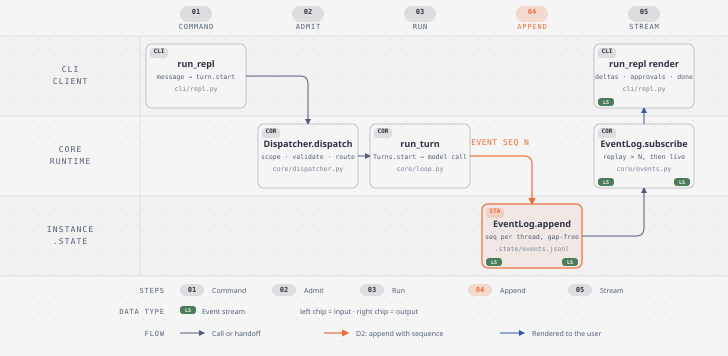
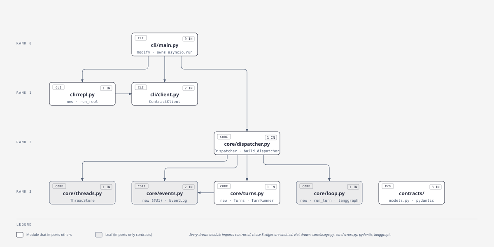
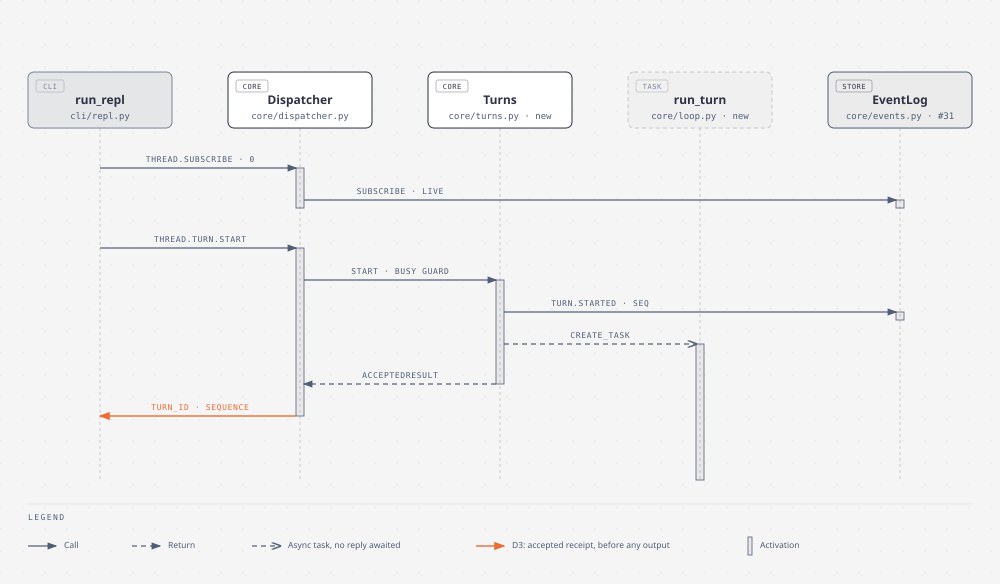
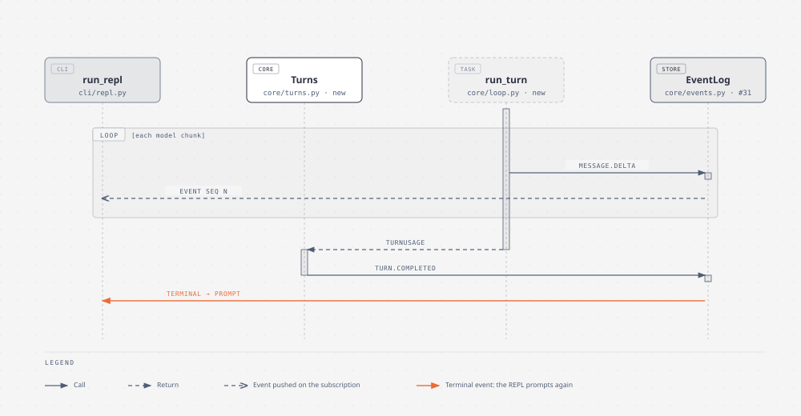
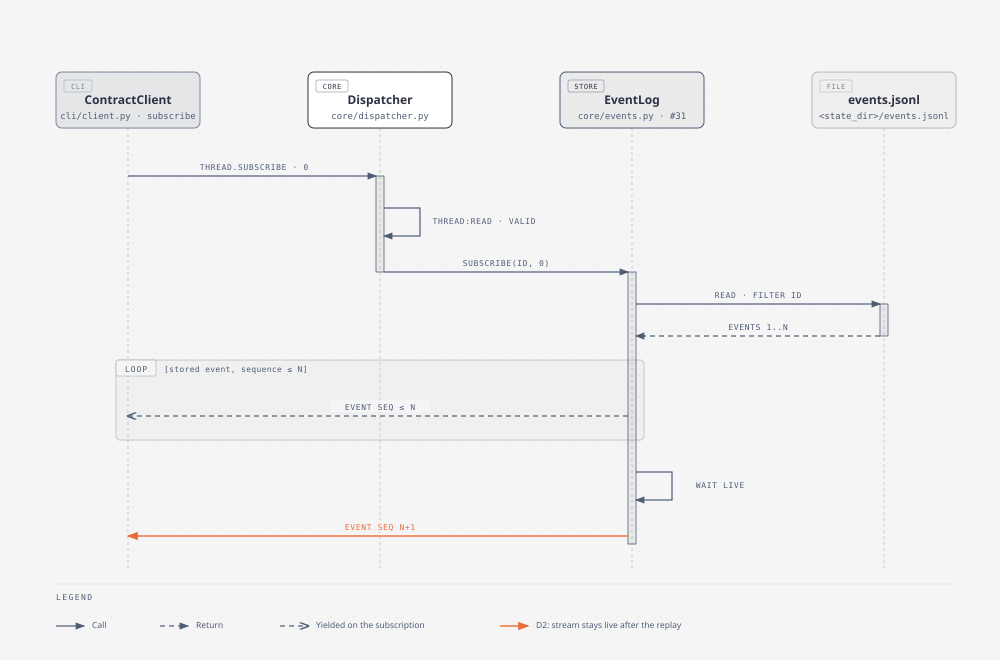
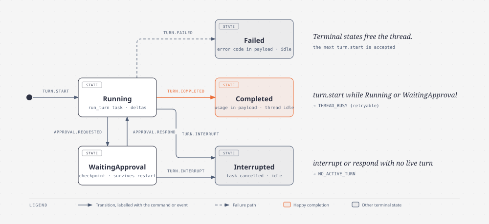

# Runtime seam: contracts, dispatcher, event stream

| | |
|---|---|
| **Status** | draft |
| **Source** | grilling on #5 (resolved), build spec #28, slice tickets #30–#35; 2026-08-25 |
| **Stamped at** | `6e18454` (paths and symbols are true at this commit; #30 merged, #31 in progress on branch `jorgesolerrr/seam-event-log-and-thread.subscribe-replay`) |
| **Owner** | Jorge Soler |

## At a glance *(explanation)*

You chat with your instance from `kinby run`, and every command the REPL sends crosses one typed boundary: Pydantic models in `kinby.contracts`, a name-routed `Dispatcher` that checks scope and validates before a handler runs, and an append-only event log that is the transcript. Commands return an accepted receipt at once; all output arrives on `thread.subscribe`, which replays stored events past a sequence number and then stays live. The decision that shapes everything else is D2: events carry a gap-free per-thread sequence, so reconnect, replay, and a future server are the same code path.

## Problem *(explanation)*

Today `kinby run` resolves the instance and stops with "The agent loop is not yet available." You cannot chat. The project also has a second client coming (a server that fronts the same core), and a session object with hand-matched methods would force a second API design. Without a sequence-numbered record, a client that drops mid-turn cannot recover what it missed, and evals cannot replay a thread.

## Solution *(explanation)*

`kinby run` opens a thread and a prompt. Each line you type becomes `thread.turn.start`. The receipt comes back immediately, and the model's reply streams onto your terminal from the subscription. Ctrl+C during a reply interrupts the turn. A second subscriber, or a restarted process, replays the thread event for event. `kinby usage` shows token totals read from those same events. Every one of these calls goes through the dispatcher, so putting a socket in front of it later changes nothing behind it.

## Decision log *(explanation)*

| # | Decision | Chosen | Rejected | Why |
|---|---|---|---|---|
| D1 | Shape of the client–core seam | Typed contract in `kinby.contracts` plus a name-routed `Dispatcher` | A plain session object; typed events only | A session object would need a second, hand-matched API for the server. With a contract, the server effort is "put a socket in front of the dispatcher". (#5, ADR 0004) |
| D2 | Client-facing record of a turn | Sequence-numbered event stream; the event log is the transcript store; the LangGraph checkpointer sits beneath it as loop working state | A plain async generator | One integer per event makes reconnect, resume, and eval replay the same code path. (#5) |
| D3 | Unary versus stream | Every command returns an accepted receipt; `thread.subscribe` is the only stream; interrupt is a plain unary call | Commands that stream their own output | Output on one channel keeps an interrupt from tangling with an in-flight response. (#5) |
| D4 | v1 method set | Seven methods: `thread.create`, `thread.list`, `thread.turn.start`, `thread.turn.interrupt`, `thread.approval.respond`, `thread.subscribe`, `usage.get` | `instance.*` config, memory queries, delete or archive | The CLI reads `kinby.toml` directly; the agent reaches memory through tools; add delete when something needs it. (#5) |
| D5 | Authorization | Per-method scopes from day one: `thread:read`, `thread:operate`, `instance:read`, `instance:admin`; the in-process CLI holds all four; the check runs before validation and before the handler | Add scopes with the server effort | Cheap now, painful to retrofit. (#5) |
| D6 | Error shape | Core raises exceptions; the dispatcher translates them into one `ErrorEnvelope` (`code`, `message`, `retryable`) and returns it as the call's value | Transliterating TS result types; per-method error types by default | Idiomatic Python inside, one envelope at the boundary. Specialize only when a caller must branch. (#5, #30) |
| D7 | Concurrency model | Async-native library; the CLI owns the single `asyncio.run` | A sync facade | No second API surface to keep in step. (#5) |
| D8 | Contract versioning | None in v1 | Version field on every model | Belongs to the server effort. (#5) |
| D9 | Import direction | `kinby.contracts` imports nothing from `kinby.core`; clients import contracts, never core handlers | Clients calling handlers directly | The boundary only holds if it is the only way in. (#28, ADR 0004) |
| D10 | Busy thread | `turn.start` on a thread whose turn is live fails with `THREAD_BUSY` | Queueing turns | One turn at a time is the model the checkpointer and token attribution assume. (#28) |
| D11 | Where events live | Append-only log in the instance's `.state/`, one `events.jsonl` (per #31) | Runtime state outside the instance | ADR 0001: tar the directory and you have moved the instance. |
| D12 | Open touchpoints | Approval answer is a placeholder (`approval_id` plus free-form `answer`) until #7; memory events wait for #8; `usage.get` returns raw token totals until #12 | Guessing those shapes now | Each belongs to a ticket still open on the map. (#28) |
| D13 | Runtime dependencies | `pydantic` (in, ADR 0004) and `langgraph` (with #32) | Hand-rolled validation; a hand-written loop | The same models define and validate the boundary; the checkpointer beneath the loop is what parks an approval across a restart. (#30, #32, #34) |
| D14 | Delivery | Six tickets in dependency order: #30 create and list → #31 event log and replay → #32 model turn → #33 interrupt, #34 approval plumbing, #35 usage | One big PR | Each ticket lands with its own tests and a green `pytest`. (#28) |
| D15 | First model turn | Model from the manifest's `models.main` (session override from `kinby run --model`), no tools yet | Tools in the first turn | Tools belong to #6 and #7. (#32) |
| D16 | Interrupt from the REPL | Ctrl+C during a turn sends `thread.turn.interrupt`; the stream ends with `turn.interrupted` | Killing the process | The thread accepts a new turn afterwards. (#33) |
| D17 | Parked approvals | A turn parked on `approval.requested` survives a process restart; `approval.respond` resumes it | In-memory pending state | The checkpointer beneath the loop already holds the parked graph. (#34) |
| D18 | Usage source | `usage.get` folds token totals recorded on `turn.completed` events, per thread and per turn; `kinby usage` prints them | A separate usage ledger | One store, one meaning. (#35) |

## User stories *(reference)*

1. As a user, I want `kinby run` to open a thread and a prompt, so that I can chat with my instance.
2. As a user, I want the model's reply to stream to my terminal as it is produced, so that I see progress instead of waiting for the whole answer.
3. As a user, I want the prompt to return only after the turn's terminal event, so that my next message goes to an idle thread.
4. As a user, I want Ctrl+C during a reply to interrupt the turn and give me the prompt back, so that I can redirect the agent.
5. As a user, I want Ctrl+C or end-of-input at the prompt to exit `kinby run` with code 0, so that I can leave cleanly.
6. As a user, I want a failed model call to end the turn with `turn.failed` and print the error code, so that I know what went wrong and can try again.
7. As a user, I want `kinby run --model` to override `models.main` for the session, so that I can test another model without editing the manifest.
8. As a user, I want a turn that needs approval to pause, show me the request, and continue after I answer, so that the agent never acts without me.
9. As a user, I want a parked approval to be answerable after I restart `kinby run`, so that a closed terminal does not lose the turn.
10. As a user, I want `kinby usage` to show token totals per thread and per turn, so that I can see what a conversation cost.
11. As a user, I want `kinby thread create` and `kinby thread list` to keep working, so that threads created before a session can be resumed later.
12. As a client author, I want every command to return an accepted receipt at once and all output on `thread.subscribe`, so that my client never blocks on a turn.
13. As a client author, I want `thread.subscribe(after_sequence=N)` to replay every stored event with sequence greater than N in order and then stay live, so that reconnecting after a drop costs one integer.
14. As a client author, I want a second subscriber with `after_sequence=0` to receive a finished thread event for event, so that evals and transcripts come from one record.
15. As a client author, I want `turn.start` on a busy thread to fail with `THREAD_BUSY` and `retryable=true`, so that I can retry instead of guessing.
16. As a client author, I want `turn.interrupt` or `approval.respond` with no live turn to fail with `NO_ACTIVE_TURN`, so that a stale click cannot touch the next turn.
17. As a client author, I want `approval.respond` with an unknown approval id to fail with `NOT_FOUND`, so that a late answer cannot resume the wrong request.
18. As a client author, I want a call without the method's scope refused with `PERMISSION_DENIED` before the handler runs, so that a read-only connection cannot operate a thread.
19. As a client author, I want an unknown method to return `NOT_FOUND` and an invalid payload `INVALID_ARGUMENT`, so that I can branch on a code instead of parsing a message.
20. As a client author, I want an unexpected handler failure to come back as `INTERNAL`, so that a bug never leaks a raw traceback across the boundary.
21. As a maintainer, I want sequences to stay gap-free per thread across process restarts, so that replay never skips or duplicates an event.
22. As a maintainer, I want the model loop's working state in the checkpointer and the client-facing record in the event log, so that neither store has two meanings.

## Bird's-eye flow *(reference)*



Source: [`birds-eye.html`](diagrams/birds-eye.html)

Prose walkthrough, one step per arrow:

1. `run_repl` in `cli/repl.py` turns the line you typed into a `thread.turn.start` payload and calls `ContractClient.call`, which calls `Dispatcher.dispatch` with the CLI's four scopes.
2. `Dispatcher.dispatch` finds the route, checks `thread:operate` is among the caller's scopes, validates the payload into `ThreadTurnStartCommand`, and calls the handler. Any failure on this path comes back as an `ErrorEnvelope` (D6).
3. The handler, `Turns.start`, refuses a live thread with `ThreadBusy` (D10), appends `turn.started`, spawns `run_turn` from `core/loop.py` as an asyncio task, and returns `AcceptedResult` with the sequence at accept (D3).
4. `run_turn` streams the model and calls `EventLog.append` for each `message.delta`. When it returns, `Turns` appends `turn.completed` with the token usage. Each append assigns the next sequence for the thread and writes one line to `.state/events.jsonl` (D2, D11).
5. `EventLog.subscribe`, opened by the REPL at session start through `Dispatcher.subscribe`, replays stored events past `after_sequence` and then yields each appended event as it lands.
6. `run_repl` renders each event: deltas inline, tool calls as lines, `approval.requested` as a question, and a terminal event as the cue to prompt again.

## Module map *(reference)*



Source: [`module-map.html`](diagrams/module-map.html)

Every drawn module imports `kinby.contracts`; those eight edges are omitted from the drawing. Not drawn: `core/usage.py` and `core/errors.py` (leaves), `pydantic` and `langgraph` (external).

### Interfaces

Existing at `6e18454` unless marked.

- `contracts.models` — `ContractModel` (Pydantic, `extra="forbid"`), `Scope`, `ErrorCode`, `ErrorEnvelope`, `ThreadCreateCommand`, `ThreadCreateResult`, `ThreadListCommand`, `ThreadListResult`, `ThreadSummary`. #31 adds `Event`, `EventType`, `ThreadSubscribeCommand`. `new`: `ThreadTurnStartCommand`, `ThreadTurnInterruptCommand`, `ThreadApprovalRespondCommand`, `AcceptedResult`, `UsageGetCommand`, `UsageGetResult`, `ThreadUsage`, `TurnUsage`. Shapes under **Data shapes**.
- `core.dispatcher.Dispatcher.register(method, scope, command, handler)` — adds a unary route. `register_subscription(...)` (#31) adds the stream route.
- `core.dispatcher.Dispatcher.dispatch(method, payload, scopes) -> BaseModel` — the unary path every client call crosses. Returns the result model or an `ErrorEnvelope`. `new`: catches `core.errors.CoreError` and maps `exc.code` and `exc.retryable` into the envelope before the generic `INTERNAL` fallback.
- `core.dispatcher.Dispatcher.subscribe(method, payload, scopes) -> AsyncGenerator[BaseModel, None]` (#31) — the one stream path. Same admission as `dispatch`; yields `Event`s, or one `ErrorEnvelope` and stops.
- `core.dispatcher.build_dispatcher(state_dir, *, event_log=None) -> Dispatcher` — wires `ThreadStore`, `EventLog`, `Turns`, and the seven routes. `new`: takes `runner: TurnRunner | None`; `None` builds `core.loop.LangGraphRunner` from the instance's models. Called by `cli/main.py` only.
- `core.threads.ThreadStore(state_dir).create(title) -> ThreadCreateResult`, `.list() -> ThreadListResult` — thread identity in `threads.jsonl`. `new`: `.exists(thread_id) -> bool` so `Turns` and the subscribe handler can answer `NOT_FOUND`.
- `core.events.EventLog(state_dir)` (#31) — `append(thread_id, turn_id, event_type, payload) -> Event` assigns the next per-thread sequence under a lock, writes the line, fans out to live subscribers. `subscribe(thread_id, after_sequence=0) -> AsyncGenerator[Event, None]` replays then stays live. `new`: `stored(thread_id) -> list[Event]` (public read for `Turns` and `usage`), `threads() -> list[UUID]`.
- `core.turns.TurnRunner` `new` — `Protocol`: `async run(turn: TurnRequest, emit: Emit) -> TurnOutcome` and `async resume(turn: TurnRequest, answer: str, emit: Emit) -> TurnOutcome`. `Emit = Callable[[EventType, Mapping[str, Any]], Awaitable[Event]]`.
- `core.turns.Turns(store, log, runner)` `new` — `start(command) -> AcceptedResult`, `interrupt(command) -> AcceptedResult`, `respond(command) -> AcceptedResult`. Holds the running task per thread; derives "live" from the thread's last event so it is right after a restart (D17). Raises `ThreadNotFound`, `ThreadBusy`, `NoActiveTurn`, `ApprovalNotFound`.
- `core.loop.LangGraphRunner(model, checkpointer)` `new` — implements `TurnRunner` with a single-node LangGraph graph that calls the chat model and emits `message.delta` per chunk; parks with `interrupt()` when a step asks for approval (test-only asking hook until #7); returns `TurnOutcome` with usage or `parked=True`.
- `core.usage.usage_totals(events, since, until) -> UsageGetResult` `new` — pure fold over `turn.completed` payloads.
- `core.errors.CoreError(Exception)` `new` — `code: ErrorCode`, `retryable: bool`; subclasses `ThreadNotFound`, `ThreadBusy` (retryable), `NoActiveTurn`, `ApprovalNotFound`.
- `cli.client.ContractClient(dispatch, subscribe, scopes)` — `call(method, payload) -> BaseModel`; `subscribe(method, payload) -> AsyncGenerator` (#31).
- `cli.repl.run_repl(client, thread_id, *, stdin, stdout, stderr) -> int` `new` — the prompt loop and the event renderer; one subscription per session.
- `cli.main.main(argv) -> int` — adds the `run` REPL branch and `kinby usage`; owns `asyncio.run` (D7).

## Ground-level flows *(reference)*

### Flow: turn start



Source: [`flow-turn-start.html`](diagrams/flow-turn-start.html)

1. `run_repl` opens the session subscription: input `{"thread_id", "after_sequence": 0}` to `Dispatcher.subscribe("thread.subscribe", …)`; output an async generator of `Event`. The REPL consumes it in a background task for the whole session.
2. `Dispatcher.subscribe` admits the call (`thread:read`, `ThreadSubscribeCommand`) and calls `EventLog.subscribe(thread_id, 0)`.
3. You type a line. `run_repl` calls `client.call("thread.turn.start", {"thread_id", "message", "model"})`: input a mapping, output `AcceptedResult | ErrorEnvelope`.
4. `Dispatcher.dispatch` admits the call (`thread:operate`, `ThreadTurnStartCommand`) and calls `Turns.start(command)`.
5. `Turns.start` checks `ThreadStore.exists`, checks the thread's last event is terminal or absent (else `ThreadBusy`), and calls `EventLog.append(thread_id, turn_id, TURN_STARTED, {"message", "model"})`: output the `Event` whose `sequence` is the sequence at accept.
6. `Turns.start` creates an asyncio task that runs `runner.run(TurnRequest, emit)` wrapped in the terminal-event handler (see **Flow: turn stream**). No reply is awaited.
7. `Turns.start` returns `AcceptedResult(thread_id, turn_id, sequence)`.
8. `Dispatcher.dispatch` returns it to `run_repl`, which prints nothing and waits for events (D3).

### Flow: turn stream



Source: [`flow-turn-stream.html`](diagrams/flow-turn-stream.html)

1. For each chunk from the model, `run_turn` calls `emit(MESSAGE_DELTA, {"text"})`, which is `EventLog.append` bound to the thread and turn: output an `Event` with the next sequence.
2. `EventLog.append` puts the `Event` on every live subscriber queue for the thread. The session subscription yields it, and `run_repl` writes `payload["text"]` without a newline.
3. `run_turn` returns `TurnOutcome(usage=TurnUsage(...))` to the task wrapper in `Turns`.
4. The wrapper calls `EventLog.append(…, TURN_COMPLETED, {"input_tokens", "output_tokens"})`.
5. The subscription yields `turn.completed`. `run_repl` prints a newline and shows the prompt.

The same wrapper produces the other terminal events. `asyncio.CancelledError` from `Turns.interrupt` → `turn.interrupted` with `{}`. Any other exception → `turn.failed` with `{"code": "INTERNAL", "message": str(exc)}`; a `CoreError` raised by the runner keeps its own `code`. `TurnOutcome(parked=True)` appends nothing: `approval.requested` was already emitted, and the thread stays live until `approval.respond` or `turn.interrupt` (see **Flow: turn lifecycle**).

### Flow: replay



Source: [`flow-replay.html`](diagrams/flow-replay.html)

1. A second `ContractClient` calls `subscribe("thread.subscribe", {"thread_id", "after_sequence": 0})`.
2. `Dispatcher.subscribe` checks `thread:read` and validates `ThreadSubscribeCommand`. On failure it yields one `ErrorEnvelope` and returns.
3. The handler calls `EventLog.subscribe(thread_id, 0)`.
4. Under the log's lock, `EventLog` reads `events.jsonl`, keeps the lines whose `thread_id` matches and whose `sequence > after_sequence`, and registers a queue for live events. Taking the snapshot and registering the queue under one lock is what makes the handoff exact: no event is missed and none is delivered twice.
5. The stored events come back as a list, in file order, which is sequence order.
6. The generator yields each stored `Event` in turn.
7. The generator awaits the queue.
8. Each event appended after the snapshot is yielded as it lands, still filtered by `sequence > after_sequence`.

### Flow: turn lifecycle



Source: [`state-turn.html`](diagrams/state-turn.html)

1. `turn.start` → Running: `Turns.start` appends `turn.started` and spawns the task.
2. Running → Completed: the runner returns usage; the wrapper appends `turn.completed`.
3. Running → Failed: the runner raises; the wrapper appends `turn.failed` with the error code.
4. Running → Interrupted: `turn.interrupt` cancels the task; the wrapper appends `turn.interrupted`.
5. Running → WaitingApproval: the runner emits `approval.requested` with `{"approval_id", "request"}` and returns `parked=True`; the graph state is in the checkpointer, no task is alive, and the thread's last event is non-terminal.
6. WaitingApproval → Running: `approval.respond` finds `approval_id` on the thread's last event (else `ApprovalNotFound`), spawns a task that calls `runner.resume(turn, answer, emit)`, and returns `AcceptedResult`.
7. WaitingApproval → Interrupted: `turn.interrupt` with no task alive appends `turn.interrupted` directly and abandons the checkpoint.
8. Any terminal state frees the thread: the next `turn.start` is accepted. "Live" is a function of the thread's last stored event, so the answer is the same after a restart (D17).

Guards that produce error codes: `turn.start` while Running or WaitingApproval → `THREAD_BUSY`, `retryable=true`. `turn.interrupt` or `approval.respond` with no live turn → `NO_ACTIVE_TURN`.

### Data shapes

New contract models in `src/kinby/contracts/models.py`, in the style of the existing ones (`ContractModel`, `UUID` ids, timezone-aware `datetime`):

```python
class ThreadTurnStartCommand(ContractModel):
    thread_id: UUID
    message: str
    model: str | None = None  # per-turn override of models.main


class ThreadTurnInterruptCommand(ContractModel):
    thread_id: UUID


class ThreadApprovalRespondCommand(ContractModel):
    thread_id: UUID
    approval_id: UUID
    answer: str  # placeholder until #7 (D12)


class AcceptedResult(ContractModel):  # shared receipt for start, interrupt, respond (D3)
    thread_id: UUID
    turn_id: UUID
    sequence: int  # sequence of the event recorded at accept


class UsageGetCommand(ContractModel):
    since: datetime | None = None
    until: datetime | None = None


class TurnUsage(ContractModel):
    turn_id: UUID
    input_tokens: int
    output_tokens: int


class ThreadUsage(ContractModel):
    thread_id: UUID
    input_tokens: int
    output_tokens: int
    turns: list[TurnUsage]


class UsageGetResult(ContractModel):
    threads: list[ThreadUsage]
```

Event envelope and types, as landed on the #31 branch:

```python
class EventType(str, Enum):
    TURN_STARTED = "turn.started"
    MESSAGE_DELTA = "message.delta"
    TOOL_CALL = "tool.call"
    TOOL_RESULT = "tool.result"
    APPROVAL_REQUESTED = "approval.requested"
    TURN_COMPLETED = "turn.completed"
    TURN_FAILED = "turn.failed"
    TURN_INTERRUPTED = "turn.interrupted"


class Event(ContractModel):
    sequence: int  # monotonic, gap-free per thread (D2)
    thread_id: UUID
    turn_id: UUID
    type: EventType
    payload: dict[str, Any]
    timestamp: datetime
```

Payloads this blueprint fixes per type. Terminal types are `turn.completed`, `turn.failed`, `turn.interrupted`.

| Type | Payload |
|---|---|
| `turn.started` | `{"message": str, "model": str}` — the resolved model name |
| `message.delta` | `{"text": str}` |
| `tool.call`, `tool.result` | reserved; no producer until #6 |
| `approval.requested` | `{"approval_id": UUID, "request": str}` |
| `turn.completed` | `{"input_tokens": int, "output_tokens": int}` |
| `turn.failed` | `{"code": ErrorCode, "message": str}` |
| `turn.interrupted` | `{}` |

Method table, locked by #5 and #28:

| Method | Scope | Command | Result |
|---|---|---|---|
| `thread.create` | `thread:operate` | `ThreadCreateCommand` | `ThreadCreateResult` |
| `thread.list` | `thread:read` | `ThreadListCommand` | `ThreadListResult` |
| `thread.turn.start` | `thread:operate` | `ThreadTurnStartCommand` | `AcceptedResult` |
| `thread.turn.interrupt` | `thread:operate` | `ThreadTurnInterruptCommand` | `AcceptedResult` |
| `thread.approval.respond` | `thread:operate` | `ThreadApprovalRespondCommand` | `AcceptedResult` |
| `thread.subscribe` | `thread:read` | `ThreadSubscribeCommand` | stream of `Event` |
| `usage.get` | `instance:read` | `UsageGetCommand` | `UsageGetResult` |

Error mapping in `Dispatcher.dispatch` and `Dispatcher.subscribe`, in order: unknown method → `NOT_FOUND`; missing scope → `PERMISSION_DENIED`; `pydantic.ValidationError` → `INVALID_ARGUMENT`; `CoreError` → its `code` and `retryable`; any other exception → `INTERNAL`, `retryable=false`. Only `THREAD_BUSY` is retryable.

Core-side shapes in `core/turns.py`:

```python
@dataclass(frozen=True)
class TurnRequest:
    thread_id: UUID
    turn_id: UUID
    message: str
    model: str


@dataclass(frozen=True)
class TurnOutcome:
    usage: TurnUsage | None = None
    parked: bool = False  # approval.requested was emitted; resume later


Emit = Callable[[EventType, Mapping[str, Any]], Awaitable[Event]]


class TurnRunner(Protocol):
    async def run(self, turn: TurnRequest, emit: Emit) -> TurnOutcome: ...
    async def resume(self, turn: TurnRequest, answer: str, emit: Emit) -> TurnOutcome: ...
```

On disk, under `manifest.state_dir` (`.state/` by default, ADR 0001): `threads.jsonl` (exists), `events.jsonl` (#31), and the checkpointer database (see **Open questions**, Q1).

REPL rendering rules, `cli/repl.py`: `message.delta` writes `text` with no newline; `tool.call` and `tool.result` write one line each; `approval.requested` prints `request`, reads one line, and sends `thread.approval.respond`; `turn.completed` prints a newline; `turn.failed` prints `code: message` to stderr; `turn.interrupted` prints `(interrupted)`. Every terminal event re-shows the prompt. Ctrl+C while a turn is live sends `thread.turn.interrupt`; Ctrl+C or EOF at the prompt returns 0.

## File map *(reference)*

Stamped at `6e18454`. Regenerate the existence check with `git ls-files src tests docs pyproject.toml CONTEXT.md`.

| Path | Action | What changes | Flow |
|---|---|---|---|
| `pyproject.toml` | modify | Add `langgraph`, `langchain`, and the checkpointer package (Q1, Q2) | turn stream |
| `uv.lock` | modify | Lockfile for the above | — |
| `src/kinby/contracts/models.py` | modify | `Event`, `EventType`, `ThreadSubscribeCommand` (#31); `ThreadTurnStartCommand`, `ThreadTurnInterruptCommand`, `ThreadApprovalRespondCommand`, `AcceptedResult`, `UsageGetCommand`, `UsageGetResult`, `ThreadUsage`, `TurnUsage` | all |
| `src/kinby/contracts/__init__.py` | modify | Re-export the new models | all |
| `src/kinby/core/dispatcher.py` | modify | `subscribe` and `register_subscription` (#31); `CoreError` mapping; `build_dispatcher(state_dir, *, event_log=None, runner=None)` registers the seven routes | turn start, replay |
| `src/kinby/core/events.py` | create (#31) | `EventLog`: `append`, `subscribe`, `stored`, `threads` | turn stream, replay |
| `src/kinby/core/threads.py` | modify | `ThreadStore.exists(thread_id)` | turn start |
| `src/kinby/core/errors.py` | create | `CoreError` and its four subclasses | turn start, turn lifecycle |
| `src/kinby/core/turns.py` | create | `TurnRequest`, `TurnOutcome`, `Emit`, `TurnRunner`, `Turns` with the task wrapper that appends terminal events | turn start, turn stream, turn lifecycle |
| `src/kinby/core/loop.py` | create | `LangGraphRunner`: model from `models.main`, streaming deltas, `interrupt()` for approvals, checkpointer beneath | turn stream, turn lifecycle |
| `src/kinby/core/usage.py` | create | `usage_totals(events, since, until)` | — |
| `src/kinby/core/__init__.py` | modify | Export `TurnRunner` alongside `Dispatcher` and `build_dispatcher` | — |
| `src/kinby/cli/client.py` | modify (#31) | `ContractClient.subscribe` | turn start, replay |
| `src/kinby/cli/repl.py` | create | `run_repl`: prompt loop, session subscription, renderer, Ctrl+C handling | turn start, turn stream |
| `src/kinby/cli/main.py` | modify | `run` creates a thread and calls `asyncio.run(run_repl(...))` after printing the instance; new `usage` subcommand; remove "The agent loop is not yet available." | all |
| `tests/test_events.py` | create (#31) | Replay, gap-free sequences across restarts, mid-stream join | replay |
| `tests/test_threads.py` | modify | `THREAD_BUSY`, `NO_ACTIVE_TURN`, `NOT_FOUND` for approvals, `CoreError` mapping | turn lifecycle |
| `tests/test_turns.py` | create | Full turn through the dispatcher with a scripted `TurnRunner`: deltas, completion, failure, interrupt, parked approval across a rebuilt dispatcher | turn start, turn stream, turn lifecycle |
| `tests/test_repl.py` | create | `run_repl` with fed stdin and a scripted runner: render, prompt after terminal, Ctrl+C interrupt, approval prompt | turn stream |
| `tests/test_run.py` | modify | `kinby run` no longer prints the placeholder; exits 0 on EOF | — |
| `tests/test_usage.py` | create | Totals per thread and per turn match recorded events; `instance:read` enforced; CLI output | — |
| `docs/adr/0005-the-event-log-is-the-transcript-store.md` | create | D2 and D11 as an ADR: sequence semantics, checkpointer beneath, `.state/` location | — |
| `CONTEXT.md` | modify | Add *turn runner*: the pluggable thing that executes one turn and emits its events | — |

## Testing *(reference)*

- **Seams**: two.
  1. `Dispatcher` from `build_dispatcher(tmp_path, runner=ScriptedRunner(...))`. This is the boundary every client crosses (D1), so a test here proves the contract, the scopes, the error envelope, the busy guard, and the event log together with no model in the loop. The scripted runner emits a fixed list of events and can raise, park, or wait on an `asyncio.Event` so the test controls timing.
  2. `run_repl(client, thread_id, stdin=io.StringIO(...), stdout=io.StringIO(), stderr=...)` with the same scripted runner behind a real dispatcher. This proves rendering and prompt discipline without a pty.
  `LangGraphRunner` is tested once, at the unit level, with a fake chat model that yields chunks and usage metadata. The provider call itself is not tested.
- **What a good test looks like here**: drive one or two contract calls, then assert on the events read back through `thread.subscribe(after_sequence=0)` and on the returned models. Never assert on task internals, queue sizes, or file layout. A test that survives replacing `events.jsonl` with SQLite is the right altitude.
- **Prior art**: `tests/test_threads.py` (dispatcher through `build_dispatcher(tmp_path)`, typed errors before a handler runs), `tests/test_thread_cli.py` (CLI through `main([...])` with `capsys`), `tests/test_events.py` on the #31 branch (replay and mid-stream join with `asyncio.wait_for`).
- **Cases**:
  1. A turn started through `thread.turn.start` streams `turn.started`, its deltas, and `turn.completed` in that order with sequences 1..n. (stories 2, 3, 12)
  2. `thread.subscribe(after_sequence=0)` on a rebuilt dispatcher replays the finished thread event for event. (14, 21)
  3. A subscriber joining after sequence k receives k+1.. once, then live events. (13)
  4. `thread.turn.start` while a turn is live returns `THREAD_BUSY` with `retryable=true`; after the terminal event a new turn is accepted. (15)
  5. `thread.turn.interrupt` during a live turn ends the stream with `turn.interrupted`; with no live turn returns `NO_ACTIVE_TURN`. (4, 16)
  6. A runner that raises ends the stream with `turn.failed` carrying `code`; a `CoreError` keeps its own code. (6, 20)
  7. A runner that parks emits `approval.requested`; a rebuilt dispatcher on the same `state_dir` accepts `thread.approval.respond` and the stream continues to `turn.completed`; an unknown `approval_id` returns `NOT_FOUND`. (8, 9, 17)
  8. A caller without `thread:operate` is refused before the handler runs; without `thread:read` the subscription yields one `PERMISSION_DENIED` envelope. (18)
  9. Unknown method → `NOT_FOUND`; invalid payload → `INVALID_ARGUMENT`; the handler never runs. (19)
  10. `usage.get` after two turns on two threads reports totals per thread and per turn equal to the recorded `turn.completed` payloads; `instance:read` is enforced. (10)
  11. `run_repl` renders deltas inline, prints the prompt only after the terminal event, prints `code: message` to stderr on `turn.failed`, and asks for and sends an approval answer. (2, 3, 6, 8)
  12. `main(["run", dir])` with empty stdin prints the instance summary, creates a thread, and exits 0. (1, 5)
  13. `main(["run", dir, "--model", m])` records `m` as `model` on `turn.started`. (7)

## Out of scope *(reference)*

- Tools in the turn, the permission gate and sandbox: #6 and #7. `tool.call` and `tool.result` exist in the taxonomy with no producer.
- Memory reads and writes and their events: #8 and #9.
- Usage buckets by provider and model, pricing, and observability output: #12.
- Resuming an existing thread from `kinby run` (a `--thread` flag). `kinby run` opens a new thread. `thread.list` shows the ids for when resume lands.
- Contract versioning: the server effort (D8).
- Compaction and checkpoint bracketing beyond what LangGraph does by default.

## Open questions *(reference)*

The agent building this stops and asks before acting on any of these.

1. **Checkpointer backend.** #34 requires a parked approval to survive a restart, so the checkpointer must persist. Options: `langgraph-checkpoint-sqlite` (`AsyncSqliteSaver`, needs `aiosqlite`) at `<state_dir>/checkpoints.sqlite`; the in-memory saver plus kinby's own parked-state file; Postgres. Recommended default: SQLite in `.state/`, which keeps ADR 0001's "tar the directory" property and adds one small dependency.
2. **Model provider packages.** `models.main` values look like `anthropic:claude-sonnet-4-6` and `openai:gpt-5`; `langchain.chat_models.init_chat_model` accepts that syntax but needs a provider package per prefix. Options: ship `langchain-anthropic` and `langchain-openai` in core dependencies; optional extras (`kinby[anthropic]`, `kinby[openai]`) with a clear error naming the missing extra; one provider only for v1. Recommended default: optional extras, because CODING-STANDARD treats each runtime dependency as a decision.
3. **Busy while parked.** #28 says `turn.start` fails when "a turn is running". A parked turn is not running, but it is not finished. Options: `THREAD_BUSY` (thread has one live turn at a time); accept the new turn and abandon the parked one. Recommended default: `THREAD_BUSY`, as drawn in the lifecycle; `turn.interrupt` is the explicit way out.
4. **Approval ids after restart.** The blueprint finds the pending approval on the thread's last stored event. If #7 later wants several pending approvals per turn, that lookup changes. Options: keep last-event lookup now; store pending approvals in the checkpointer state and query it. Recommended default: last-event lookup; revisit with #7.
5. **`thread.subscribe` on an unknown thread.** The #31 branch yields an empty, live stream. Options: keep that; return `NOT_FOUND` via `ThreadStore.exists` before the handler runs. Recommended default: `NOT_FOUND`, for symmetry with `turn.start`; decide it inside the #31 review.
6. **Event file layout.** #31 uses one `events.jsonl` for all threads and recomputes the next sequence by scanning the file on every append. Fine for a single user's first threads; it becomes the cost centre once threads are long. Options: keep and add an in-memory `{thread_id: last_sequence}` cache warmed at startup; one file per thread; SQLite shared with Q1. Recommended default: keep the single file, add the cache in #32 when appends become frequent.
7. **Interrupt key at the prompt versus in a turn.** #33 says Ctrl+C sends the interrupt. At the prompt, with no turn live, the blueprint exits. Options: exit; ignore; require a second Ctrl+C. Recommended default: exit with 0.

## Glossary *(reference)*

- **Instance** — one kinby deployment: a directory that owns its configuration, memory, and transcripts; runtime state lives in its `.state/`.
- **Thread** — one conversation with its own durable history; survives across sessions.
- **Session** — one run of the agent loop against a thread, from `kinby run` to exit.
- **Turn** — one user-to-agent cycle within a thread, from a user message until the agent yields control; the unit of token attribution.
- **Turn runner** — the pluggable thing that executes one turn and emits its events (`TurnRunner`); `LangGraphRunner` in production, a scripted runner in tests. New term; add to `CONTEXT.md`.
- **Contract** — the typed set of commands and subscriptions every client uses to drive a session; `kinby.contracts`.
- **Event** — one sequence-numbered record emitted while a turn runs; what clients subscribe to and the transcript store persists.
- **Scope** — a named permission a contract command requires of its caller.
- **Transcript store** — the canonical record of every conversation; here, the event log.
- **Manifest** — `kinby.toml`, the portable description of an instance; `models.main` and `state_dir` come from it.
